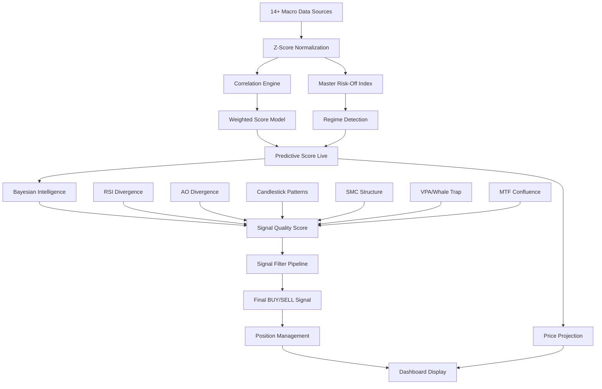

# 📖 Titan Quant v11 — Dokumentasi Lengkap

> **Script**: `titannew.pine` | **Versi**: v11.0.0 — Institutional Macro-Quantitative Engine
> **Platform**: TradingView Pine Script v6 | **Target**: XAUUSD (Gold)
> **Total Lines**: ~5,070 | **Overlay**: Yes

---

## 📑 Daftar Isi

1. [Arsitektur Umum](#1-arsitektur-umum)
2. [Data Fetching & Macro Sources](#2-data-fetching--macro-sources)
3. [Z-Score Normalization & Fallback](#3-z-score-normalization--fallback)
4. [Correlation Engine](#4-correlation-engine)
5. [Master Risk-Off Index](#5-master-risk-off-index)
6. [Regime Detection & Classification](#6-regime-detection--classification)
7. [Macro Confirmation Vote](#7-macro-confirmation-vote)
8. [Predictive Score Engine](#8-predictive-score-engine)
9. [Bayesian Intelligence](#9-bayesian-intelligence)
10. [Multi-Timeframe (MTF) Confluence](#10-multi-timeframe-mtf-confluence)
11. [Signal Quality Score](#11-signal-quality-score)
12. [Divergence Engines (RSI + AO)](#12-divergence-engines-rsi--ao)
13. [Candlestick Pattern Recognition](#13-candlestick-pattern-recognition)
14. [SMC Structure Engine (BOS/CHoCH)](#14-smc-structure-engine-boschoch)
15. [VPA & Whale Trap Detection](#15-vpa--whale-trap-detection)
16. [Institutional Order Blocks](#16-institutional-order-blocks)
17. [Price Projection (Quantum Predictor)](#17-price-projection-quantum-predictor)
18. [Risk Management & Position Sizing](#18-risk-management--position-sizing)
19. [Signal Generation Pipeline](#19-signal-generation-pipeline)
20. [Position Management & Exit Logic](#20-position-management--exit-logic)
21. [Dashboard & Visualization](#21-dashboard--visualization)
22. [Preset System](#22-preset-system)
23. [Flow Diagram](#23-flow-diagram)

---

## 1. Arsitektur Umum

Titan Quant adalah **institutional-grade overlay indicator** untuk XAUUSD yang menggabungkan:



### Custom Types

| Type | Fungsi |
|------|--------|
| `CircuitTracker` | Melacak kegagalan data per aset (12 field: rrp, yield, etf, vix, dxy, spx, credit, usdjpy, usdchf, tlthyg, xlpxly, spyvol) |
| `FallbackZ` | Menyimpan Z-score terakhir yang valid sebagai fallback (15 field termasuk us02y, us10y, yc) |
| `MacroCorr` | Ring-buffer O(1) correlation calculator dengan rolling moments |

---

## 2. Data Fetching & Macro Sources

### Primary Assets (14 Sources)

| # | Symbol | Nama | Timeframe | Relasi ke Gold |
|---|--------|------|-----------|----------------|
| 1 | `FRED:RRPONTSYD` | Reverse Repo | Daily | Inverse (likuiditas) |
| 2 | `FRED:DFII10` | Real Yield 10Y TIPS | Daily | Inverse (kuat) |
| 3 | `AMEX:GLD` | Gold ETF | Macro TF | Direct proxy |
| 4 | `TVC:VIX` | Volatility Index | Macro TF | Positive (fear→gold up) |
| 5 | `TVC:DXY` | Dollar Index | Macro/H1* | Inverse (kuat) |
| 6 | `SP:SPX` | S&P 500 | Macro TF | Inverse (risk rotation) |
| 7 | `FRED:BAMLH0A0HYM2` | Credit Spread HY | Daily | Positive (stress) |
| 8 | `OANDA:USDJPY` | USD/JPY | Macro TF | Inverse |
| 9 | `OANDA:USDCHF` | USD/CHF | Macro TF | Inverse |
| 10 | `CBOE:TLTW / AMEX:HYG` | TLT/HYG Ratio | Macro TF | Positive (safe haven) |
| 11 | `AMEX:XLP / AMEX:XLY` | XLP/XLY Ratio | Macro TF | Positive (defensif) |
| 12 | `TVC:US02Y` | 2Y Treasury Yield | Macro/H1* | Inverse (policy) |
| 13 | `TVC:US10Y` | 10Y Treasury Yield | Macro/H1* | Inverse |
| 14 | `AMEX:SPY` | SPY (Volume) | Macro TF | Sentiment proxy |

> \* H1 fetch digunakan pada preset "Aggressive Scalping 1m" untuk reaksi lebih cepat

### Auxiliary Data
- **XAU Intrinsic Basket**: `XAUEUR` + `XAUJPY` — menghitung kekuatan emas murni tanpa pengaruh USD
- **Yield Curve**: `US10Y - US02Y` — dikonversi ke ROC untuk Z-Score komparabilitas
- **DGS20**: Treasury Yield 20Y (FRED) — fallback untuk TLT/HYG

### Fetch Optimization
- `request.security()` dengan `gaps=barmerge.gaps_off, lookahead=barmerge.lookahead_off`
- Intraday data di-reuse dari macro RT untuk menghemat API calls (batas 40)
- Helper function `f_get_macro_stats()` mengambil `[close, close[1], sma, stdev]` dalam 1 call

---

## 3. Z-Score Normalization & Fallback

### Proses Normalisasi

```
Z = (Value - Mean) / max(0.01, StdDev)
```

> **Critical Fix**: `std_safe()` clamp minimum ke 0.01 untuk mencegah Z-score meledak saat StdDev mikro

### Dual-Layer Z-Score
Setiap aset memiliki 2 Z-score:
1. **z_live** — dari data real-time/intraday
2. **z_model** — dari data model (close[1] pada macro TF)

### Selection Logic (`f_choose_z`)
```
Priority: z_live (jika valid) → z_model (jika valid) → last_known (dari FallbackZ store)
```

### Circuit Breaker
- Setiap aset memiliki counter di `CircuitTracker`
- Jika data valid → counter decremented, jika NA → counter incremented
- Data dianggap valid jika counter < `cb_threshold` (default: 3)

---

## 4. Correlation Engine

### Implementasi
- **Ring-buffer O(1)** correlation calculator menggunakan `MacroCorr` type
- Rolling moments (sum_g, sum_a, sum_g2, sum_a2, sum_ga) di-update inkremental
- Pearson correlation formula: `r = (n*Σxy - Σx*Σy) / √((n*Σx² - (Σx)²)(n*Σy² - (Σy)²))`
- Clamped ke [-1.0, 1.0]

### Dua Set Korelasi
1. **Weight Correlations** (`w_*`) — lookback = `model_len` (50) — digunakan sebagai bobot dinamis
2. **Display Correlations** (`corr_*`) — lookback = `lookback_corr` (20) — untuk confidence score

### Assets yang Dikorelasikan
Gold vs: RRP, Yield, ETF, VIX, DXY, SPX, Credit, USDJPY

---

## 5. Master Risk-Off Index

### Formula
Weighted average dari 14+ Z-scores dengan dynamic volatility multiplier:

```
risk_off_index = Σ(z_i × w_i × [fear_mult]) / Σ|w_i|
```

### Komponen & Arah

| Komponen | Arah ke Gold | Fear Asset? |
|----------|-------------|-------------|
| VIX ↑ | Bullish | ✅ (×mult_vol) |
| Real Yield ↓ | Bullish | ✅ |
| Credit Spread ↑ | Bullish | ✅ |
| DXY ↓ | Bullish | ✅ |
| USDJPY ↓ | Bullish | — |
| USDCHF ↓ | Bullish | — |
| TLT/HYG ↑ | Bullish | — |
| XLP/XLY ↑ | Bullish | — |
| SPY Vol × RetSign | Mixed | ✅ |
| RRP ↓ | Bullish | ✅ |
| Yield Curve ↓ | Bullish | ✅ |
| US02Y ↓ | Bullish | ✅ |
| US10Y ↓ | Bullish | ✅ |
| Qualitative Bias | Manual | — |

### Dynamic Vol Multiplier
```
mult_vol = 1.0 + 0.5 × vol_score  (mode "Dynamic Vol-Adj")
```
Fear assets mendapat amplifikasi saat volatilitas tinggi.

---

## 6. Regime Detection & Classification

### Threshold System (3-Tier)

| Regime | Condition |
|--------|-----------|
| **Extreme Risk-Off** | `risk_off_index ≥ th_extreme` |
| **Strong Risk-Off** | `risk_off_index ≥ th_strong` |
| **Risk-Off** | `risk_off_index ≥ th_low` |
| **Neutral** | Between thresholds |
| **Risk-On** | `risk_off_index ≤ -th_low` |
| **Strong Risk-On** | `risk_off_index ≤ -th_strong` |
| **Extreme Risk-On** | `risk_off_index ≤ -th_extreme` |

### Auto-Adaptive Mode
```
th_low_dyn = risk_ma + 0.5 × risk_std
th_str_dyn = risk_ma + 1.5 × risk_std
```

---

## 7. Macro Confirmation Vote

### Mekanisme: 13-Factor Voting System

**Risk-Off (Gold Bullish) Factors:**
1. Real Yield turun (z < -0.3)
2. VIX 19-40 (safe haven rally)
3. SPX turun (ROC < 0)
4. DXY lemah (z < -0.2)
5. Credit spread melebar (z > 0.3)
6. Yen menguat (z_USDJPY < -0.2)
7. CHF menguat (z_USDCHF < -0.2)
8. TLT > HYG (z > 0.2)
9. XLP > XLY (z > 0.2)
10. US10Y turun (z < -0.3)
11. US02Y turun (z < -0.3)
12. Yield Curve inverted ATAU bull steepen
13. GLD ETF inflow (z > 0.2)

**Risk-On (Gold Bearish)**: Mirror opposite dengan exception logic (US10Y naik hanya bearish jika Real Yield tidak anjlok).

**Konfirmasi**: Minimal 3/13 vote + risk_state alignment.

---

## 8. Predictive Score Engine

### Score Computation Flow

```
1. Weighted Score Model: Σ(z_i × corr_weight_i × risk_w_i) / Σ|weights|
2. + Responsiveness Delta: resp_gain × weighted_delta(live - model)
3. Hyper-Response Smoothing: EMA dengan adaptive alpha (vol-aware)
4. → score_live (final smoothed score)
```

### Asymmetrical Thresholds
```
th_buy  = base_th × (VIX > 18 ? 0.70 : 0.85)   ← lebih mudah trigger BUY saat fear
th_sell = base_th × (VIX < 17 ? 0.90 : 1.10)    ← lebih sulit trigger SELL saat calm
```

### Velocity-Forward Projection
```
action_score_proj = score_live + (momentum × 2.5)  ← project 2-3 bar ahead
```

---

## 9. Bayesian Intelligence

### Naive Bayes Implementation

```
P(Bull|Evidence) = P(Bull) × P(Trend|Bull) × P(Mom|Bull) × P(Vol|Bull) / Normalization
```

**Prior**: Asymmetric sigmoid dari macro_score (negative macro di-penalti 1.5×)

**Evidence Vectors:**
1. **Trend**: Price > HMA/EMA (configurable)
2. **Momentum**: RSI > 50
3. **Volume**: Vol_score > 1.0 + directional candle

**Output**: `bayes_conf_bull` (0-100%) — probabilitas sinyal bullish berhasil.

### VPA 3.0 Bayesian Multiplier
Stopping Volume, Absorption, atau CVD Divergence boost Bayesian confidence ×1.4.

---

## 10. Multi-Timeframe (MTF) Confluence

### 4-Timeframe Grid
Default: M5, M15, H1, H4 — masing-masing dievaluasi `close > HMA(55)`.

### Scoring
```
mtf_conf_score = bullish_count / 4.0   (jika ≥ min_agreement)
mtf_buy_valid  = bull_count ≥ 2 AND bull_count ≥ bear_count
mtf_sell_valid = bear_count ≥ 1        ← SELL intentionally lebih permissive
```

---

## 11. Signal Quality Score

### 12-Component Weighted Formula

| Component | Weight Category | Description |
|-----------|----------------|-------------|
| Correlation Avg | `norm_corr` | Rata-rata abs korelasi 7 aset |
| Agreement | `norm_agree` | Status agreement / 4 |
| Magnitude | `norm_mag` | abs(scenario_index) |
| Volatility | `norm_vol` | 1 - vol_score |
| Vol Divergence | `norm_vol_div` | SPY volume Z-score |
| Intrinsic Sync | `norm_elite` | XAU basket alignment |
| Bayes Confidence | `norm_elite` | Bayesian posterior |
| MTF Confluence | `norm_elite` | MTF agreement score |

### Boosters (Additive)
- **Pattern Booster**: 0-0.15 (strength-proportional)
- **RSI Divergence**: +0.15
- **AO Divergence**: +0.04 to +0.12 (strength-based)
- **Power Div**: +0.08 to +0.20
- **AO Pattern (Twin Peaks/Saucer)**: +0.08 to +0.12
- **AO Velocity**: ±0.06
- **Volume Events**: -0.10 to +0.20
- **Cluster Tier**: +0.06 to +0.16

### Multipliers
```
quality_score × session_mult × setup_mult
```
- Session: Kill Zone ×1.25, Asian ×0.5
- Setup: Whale Trap ×1.25, Power Div ×1.30, dll.

### Quality Grades
| Grade | Range | Sizing Factor |
|-------|-------|---------------|
| A+ | > 0.85 | 100% |
| A | > 0.70 | 80% |
| B | > 0.55 | 50% |
| C | > 0.40 | 25% |
| D | ≤ 0.40 | 25% |

---

## 12. Divergence Engines (RSI + AO)

### RSI Divergence
- **Pivot**: lookback 2/2 (fast untuk M5)
- **Regular Bullish**: Price LL + RSI HL (reversal)
- **Hidden Bullish**: Price HL + RSI LL (continuation)
- **Tier System**: Strict (RSI < 65) + Relaxed (RSI < 80)
- **Strength Score** (0-100): RSI magnitude + zone + distance + tier + candle confirm
- **Memory Window**: 60 bars

### AO (Awesome Oscillator) Divergence v2.0
- **VWAO**: Volume-Weighted AO dengan adaptive period (ATR-based compression)
- **6 Upgrades**: Min gap (ATR), candle confirm, zone filter, adaptive pivot, strength scoring, tight filters
- **Patterns**: Twin Peaks + Saucer (Bill Williams classics)
- **Velocity**: ao_velocity (ROC 3-bar) + ao_accel (acceleration)
- **Memory Window**: 40-50 bars (adaptive)

### Power Divergence
```
POWER DIV = RSI Divergence + AO Divergence (concurrent)
Combined Score = AO_strength × 0.60 + RSI_strength × 0.40 + velocity_bonus
Grade: ELITE (≥80) / STRONG (≥60) / STANDARD (≥40) / WEAK
```

---

## 13. Candlestick Pattern Recognition

### Supported Patterns
| Pattern | Type | Filters |
|---------|------|---------|
| **Hammer** | Bullish reversal | Wick > 2.5× body, swing low, fractal |
| **Shooting Star** | Bearish reversal | Wick > 2.5× body, swing high, fractal |
| **Engulfing** | Both | Smart confirm (close > pattern high) |
| **Power Engulfing** | Both | Body > 1.5× prev range |
| **Liquidity Sweep** | Both | Price breaks swing then closes back |
| **Doji** | Indecision | Body ≤ 10% range, BB/RSI extreme |

### Quality Layers
1. ATR min range gate
2. Trend context (HMA/SMA baseline)
3. Fractal validation
4. Volume validation (VPA)
5. MTF validation (M15/H1)
6. Cooldown anti-spam
7. Order Block proximity (+15 strength bonus)

### Cluster Detection (Weighted Confluence)
- **Tier 1 (COMBO)**: Score ≥ 2.0
- **Tier 2 (POWER CLUSTER)**: Score ≥ 3.5
- **Tier 3 (APEX)**: Score ≥ 5.5 + anchor signal

---

## 14. SMC Structure Engine (BOS/CHoCH)

### Detection
- **Minor Structure**: `ta.pivothigh/low(smc_len)` — default 5
- **Major Structure**: `ta.pivothigh/low(smc_len_major)` — default 20

### Break Classification
- **BOS** (Break of Structure): Break in same trend direction
- **CHoCH** (Change of Character): Break against trend → trend reversal

### Filters
- Macro trend alignment
- RSI momentum validation
- Emergency bypass mode for debugging

### FVG (Fair Value Gap) v2.0
- 3-tier quality: Valid → Strong → Premium
- Displacement body > 45%, volume validation
- CE (Consequent Encroachment) midpoint for precision entries

### Breaker Blocks
Created pada Major CHoCH events.

---

## 15. VPA & Whale Trap Detection

### VPA 3.0 Components

| Signal | Description | Vol Requirement |
|--------|-------------|-----------------|
| **Ignition** | Institutional breakout | Z > 2.5 + strong body + breakout |
| **Climax** | Ultra vol + rejection wick | Ultra vol + body < 45% range |
| **Churn** | High effort, low result | High vol + tight range |
| **Stopping Volume** | Smart money reversal | Ultra vol at trend extreme |
| **No Demand/Supply** | Healthy pullback | Low vol + narrow bar |
| **Test Volume** | OB zone retest | Low vol at proven zone |
| **Absorption** | Institutional accumulation | High vol + narrow spread at extreme |

### Whale Trap v10.0 (6-Layer Fusion)

| Layer | Name | Logic |
|-------|------|-------|
| A | Structural Boundaries | Fractal high/low breaks |
| B | Volatility Dynamics | ATR outlier + deep reflux close |
| C | Purity Divergence | XAU basket vs USD price disagreement |
| D | Session Edge | Kill zone windows (London/NY) |
| E | Sequential Stop-Runs | 2+ traps in 20 bars = triple trap |
| F | Macro Fusion | DXY/Yield extreme + VIX stress + exhaustion |

### CVD (Cumulative Volume Delta)
```
bar_delta = volume × (close-low)/(high-low) - volume × (high-close)/(high-low)
CVD divergence: Price down + CVD up = hidden accumulation
```

---

## 16. Institutional Order Blocks

### Zone Detection
- **Demand**: Last bearish candle before strong bullish breakout
- **Supply**: Last bullish candle before strong bearish breakdown
- Requires: body > 1.3× avg range

### Confluence Scoring (7-Factor, 0-100 → 1-5 Stars)
Volume, Macro, MTF, Session, Body %, RSI, Bayes

### Zone Management
- 3 active zones per side (FIFO rotation)
- Mitigation: close below demand / above supply
- Expiry: 200 bars
- Cluster detection (40% overlap)

### Quantum Confluence
OB zones that align with Price Projection target get "QUANTUM" upgrade with gold highlighting.

---

## 17. Price Projection (Quantum Predictor)

### Multi-Factor Model (9 sensitivities)

| Factor | Sensitivity |
|--------|------------|
| DXY | -1.20 |
| Yield | -1.00 |
| US02Y | -0.80 |
| VIX | +0.75 |
| GLD ETF | +0.65 |
| USDJPY | -0.55 |
| SPX | -0.50 |
| Yield Curve | -0.45 |
| RRP | -0.40 |

### Adjustments
- **Gamma Boost**: Non-linear response for extreme Z > 2.5 (×1.50)
- **Regime Multiplier**: Risk-Off → VIX/ETF amplified ×1.15
- **Momentum Alignment**: ×1.10 if macro + price agree
- **Exhaustion Dampening**: ×0.75 if momentum decay
- **MTF Conflict**: ×0.65 if projection vs MTF disagree
- **Volatility Squeeze**: Shorter horizon when BB width compressed
- **BB Anchor**: Target clamped to ±3σ Bollinger Bands

### Accuracy Tracking
Rolling MAE (Mean Absolute Error) over last 20 predictions using ring-buffer.

---

## 18. Risk Management & Position Sizing

### Stop Loss
```
SL = ATR(20) × 1.5 × dynamic_multiplier
dynamic_multiplier = max(1.0, min(1.5, √(vol_ratio)))
```

### Take Profit (3-Level)
| Level | Fixed R:R | Smart Mode |
|-------|-----------|------------|
| TP1 | SL × 1.5 | SL × 1.5 × vol_scale |
| TP2 | SL × 3.0 | Projected Target (if valid) |
| TP3 | SL × 5.0 | SL × 5.0 × vol_scale (Runner) |

### Position Sizing
```
rec_risk = base_risk% × vol_factor × qual_factor
```
- **Volatility Factor**: 1/√(vol_ratio), capped [0.5, 1.5]
- **Quality Factor**: A+=100%, A=80%, B=50%, C/D=25%

---

## 19. Signal Generation Pipeline

### 5-Path Signal Architecture

```
Path 1: STANDARD — All filters pass (quality + regime + sniper + intrinsic + trend + confluence + vol)
Path 2: BYPASS — Ignition/Power Div + quality + trend + Bayes ≥ 65%
Path 3: FAST BYPASS — Score > 1.5× threshold + vol guard
Path 4: APEX REVERSAL — Score was extreme + momentum flip + rejection signals
Path 5: DEEP REVERSAL — Strong rejection + confluence ≥ 3 + divergence support
```

### Filter Layers (18 checks)

1. Quality gate (adaptive per mode)
2. Regime validity (risk state alignment)
3. Bayesian sniper threshold (adaptive)
4. XAU intrinsic basket sync
5. Trend alignment (HMA cross + counter-trend gate)
6. Institutional confluence (8-factor scoring, min threshold)
7. Volatility regime (ATR5/ATR20 ratio)
8. Volume guard (vol_ratio > 0.4)
9. Session timing
10. Exhaustion check (high vol + momentum decay)
11. Chop market filter (EMA spread / ATR)
12. Whale trap soft block
13. Counter-accumulation check
14. Flip risk guard (prevent rapid direction change)
15. Same-side echo suppression
16. Signal rearm cooldown (adaptive per TF)
17. Momentum rearm (score_mom crossover)
18. Periodic/confluence pulse rearm

### Sniper Density Modes
| Mode | Behavior |
|------|----------|
| **Classic** | Strict filtering, fewer signals |
| **Adaptive Frequent** | Relaxed thresholds, confluence guard |
| **Aggressive Scalper** | Maximum frequency for M1/M5 |

---

## 20. Position Management & Exit Logic

### Entry
- Mutually exclusive: only BUY or SELL per bar
- **Reversal context tagging**: Entries via APEX/Power Div/deep divergence flagged as `position_is_reversal`

### Exit Conditions (6 types)

| Exit Type | Logic |
|-----------|-------|
| **Hard Stop** | PnL ≤ -ATR-based stop % |
| **Score Invalidation** | Score crosses against position |
| **Trend Flip** | 2 consecutive bars of opposing HMA trend |
| **Profit Protection** | Peak PnL ≥ lock level + (decay/rejection/giveback) |
| **Opposite Signal** | New signal in opposite direction |
| **Momentum Decay Take** | Mom decay + sufficient profit |

### Reversal-Specific Tuning
- Grace period (3-7 bars) before exit filters activate
- Wider stops (×rev_stop_mult)
- Profit lock thresholds (rev_profit_lock)
- Trailing giveback tolerance
- All parameters **adaptive per timeframe** (M1→H1)

---

## 21. Dashboard & Visualization

### Info Panel Rows

| Row | Content |
|-----|---------|
| Header | ⚔️ TITAN QUANT |
| Action | Direction + Score (BULL RUN / COUNTER BUY / etc.) |
| Scanner | Position status (IN LONG/SHORT + P&L + duration) |
| Status | Trade readiness (SNIPER READY / REGIME BLOCK / etc.) |
| Regime | Risk regime + extreme warning |
| Diag | Setup type classifier |
| Veloc | Momentum velocity + decay warning |
| Impact | Scenario impact + quantum proximity heatmap |
| Quality | Grade + score + institutional tag |
| Bayes | Bull% / Bear% dual gauge |
| Mom | Momentum state (HYPER-DRIVE / EXHAUSTION / etc.) |
| AO Div | Latest AO divergence + strength |
| Intrinsic | XAU basket purity (PURE BULL/BEAR, FAKE PUMP, etc.) |
| Money Mgmt | Rec. Risk% + R:R ratio (TP1|TP2) |
| Setup | Current setup type + icon |
| Scenario | Scenario text + confidence |
| Price Tgt | Projected target price |
| MTF | 4-TF emoji grid (🟢🔴⚪) |
| API | API usage counter /40 |

### Chart Labels
- **▲ BUY / SELL ▼**: Main signals (compact, tooltip detail)
- **⚡DIV+BUY/SELL**: High-accuracy divergence
- **🟢⚡ POWER BUY/SELL**: RSI+AO confluence
- **🟩 AO↑ BUY / 🟥 AO↓ SELL**: Standalone AO divergence
- **💎/🌌**: Raw divergence early warnings
- **☠️ Trap**: Whale trap detection
- **❇️/🛑**: Absorption signals
- **⚡ APEX**: Cluster tier 3
- **🔗**: Cluster tier 2
- **BOS/CHoCH**: Structure breaks
- **✕**: Rejected signals

### Bar Coloring
- Silver: Ignition
- Orange: Climax
- Purple: Churn

---

## 22. Preset System

### 3 Built-in Presets

| Preset | Target | Key Differences |
|--------|--------|-----------------|
| **XAUUSD M5 Pro** | M5 Gold scalping | Balanced weights, tf_macro="240", HMA 40 |
| **Aggressive Scalping 1m** | M1 hyper-scalping | Extreme sensitivity, qual_min=0.15, H1 hybrid fetch |
| **Day Trading 5m** | M5 kill zone trading | Moderate, tf_analysis="15", session focus |

### Parameter Overrides
Presets override 30+ parameters including:
- Risk weights (all 14 macro assets)
- Thresholds (model, risk, quality)
- Lookback periods (Z-score, correlation, model)
- Smoothing (alpha, responsiveness, circuit breaker)
- Bayesian params (sniper thresh, HMA len, P(trend))
- Timeframe routing (macro, analysis)

---

## 23. Flow Diagram

### Complete Signal Flow

```
BAR UPDATE
    │
    ├─► Fetch 14+ macro assets via request.security()
    ├─► Calculate Z-scores (live + model) for each
    ├─► Update Circuit Breaker tracker
    ├─► Select best Z (live → model → fallback)
    │
    ├─► Correlation Engine (ring-buffer O(1))
    │       └─► Dynamic weights for score model
    │
    ├─► Master Risk-Off Index (14-factor weighted)
    │       ├─► Regime Classification (7-tier)
    │       └─► Macro Vote (13-factor binary)
    │
    ├─► Predictive Score (weighted + delta + smoothing)
    │       ├─► Asymmetric thresholds (VIX-aware)
    │       └─► Velocity projection (2-3 bar lookahead)
    │
    ├─► Bayesian Engine (prior × 3 evidence vectors)
    │
    ├─► Technical Analysis Layer
    │       ├─► RSI Divergence (strength scored)
    │       ├─► AO Divergence v2.0 (6 upgrades)
    │       ├─► Power Div (RSI + AO combined)
    │       ├─► Candlestick Patterns (7 types, strength scored)
    │       ├─► Cluster Detection (weighted, 3-tier)
    │       ├─► VPA 3.0 (6 signal types)
    │       ├─► Whale Trap v10.0 (6-layer fusion)
    │       └─► SMC (BOS/CHoCH/FVG/Breaker)
    │
    ├─► MTF Confluence (4-TF HMA agreement)
    │
    ├─► Signal Quality Score (12 components + boosters)
    │
    ├─► Signal Filter Pipeline (18 checks, 5 paths)
    │       ├─► Standard path
    │       ├─► Bypass path (ignition/power div)
    │       ├─► Fast bypass path (extreme score)
    │       ├─► APEX reversal path
    │       └─► Deep reversal path
    │
    ├─► Final Signal (anti-spam + cooldown + flip guard)
    │
    ├─► Position Management
    │       ├─► Entry (reversal context tagging)
    │       ├─► PnL tracking (peak, giveback)
    │       └─► Exit (6 conditions, reversal-aware)
    │
    ├─► Price Projection (9-factor quantum model)
    │       └─► Accuracy tracking (rolling MAE)
    │
    ├─► Order Block Visualizer (quantum confluence)
    │
    └─► Dashboard Render (20+ rows, real-time on last bar)
```

---

> [!IMPORTANT]
> Script ini di-desain khusus untuk **XAUUSD** dengan sensitivitas koefisien yang di-tune untuk Gold.
> Penggunaan pada instrumen lain memerlukan re-kalibrasi seluruh sensitivity coefficients dan macro weights.

> [!TIP]
> Untuk trading M5, gunakan preset **"XAUUSD M5 Pro"** sebagai baseline.
> Untuk scalping M1, gunakan **"Aggressive Scalping 1m"** dengan awareness bahwa noise lebih tinggi.
