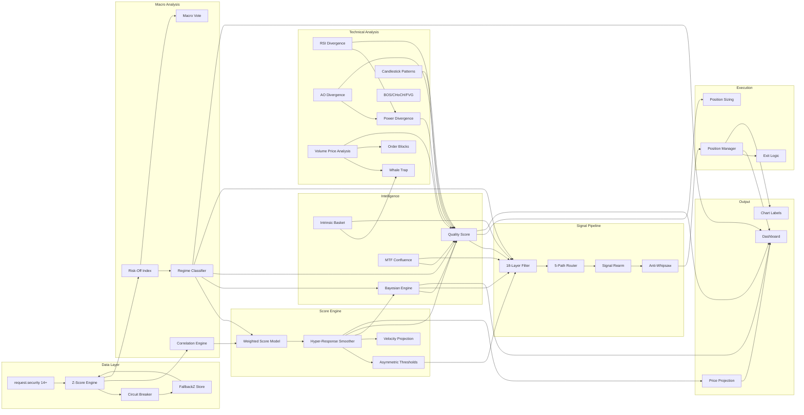

# 📖 Titan Quant v11 — Part 4: Advanced Reference & Input Catalog

> Lanjutan dari [Part 1](file:///C:/Users/fembi/.gemini/antigravity/brain/3c407812-46ba-4401-a03f-1ebddc94faeb/titan_quant_documentation.md), [Part 2](file:///C:/Users/fembi/.gemini/antigravity/brain/3c407812-46ba-4401-a03f-1ebddc94faeb/titan_quant_deep_dive_part2.md), dan [Part 3](file:///C:/Users/fembi/.gemini/antigravity/brain/3c407812-46ba-4401-a03f-1ebddc94faeb/titan_quant_part3_practical.md)

---

## 📑 Daftar Isi

1. [Input Parameter Catalog](#1-input-parameter-catalog)
2. [Preset Override Detail](#2-preset-override-detail)
3. [Session Logic](#3-session-logic)
4. [Intrinsic Strength Basket](#4-intrinsic-strength-basket)
5. [HMA Trend Engine & M5 Optimizer](#5-hma-trend-engine--m5-optimizer)
6. [Momentum Decay Detection](#6-momentum-decay-detection)
7. [Dashboard Render Pipeline](#7-dashboard-render-pipeline)
8. [Alert & Status Line Output](#8-alert--status-line-output)
9. [Architectural Dependency Map](#9-architectural-dependency-map)

---

## 1. Input Parameter Catalog

### 1.1 Grup: Core Engine

| Input | Type | Default | Range | Penjelasan |
|-------|------|---------|-------|-----------|
| `base_threshold` | float | 0.30 | 0.10-0.80 | Threshold utama untuk score crossover BUY/SELL |
| `model_len` | int | 50 | 15-100 | Lookback SMA/StdDev untuk Z-Score calculation |
| `lookback_corr` | int | 20 | 10-50 | Lookback untuk display correlation (confidence) |
| `smoothing_alpha` | float | 0.15 | 0.05-0.50 | EMA alpha untuk score smoothing (tinggi = reaktif) |
| `responsiveness_gain` | float | 2.50 | 0.5-6.0 | Gain multiplier untuk responsiveness delta |
| `risk_tol` | string | "Medium" | Low/Med/High | Toleransi risiko → affects sample minimum |
| `risk_calc_mode` | string | "Dynamic Vol-Adj" | — | Risk calc mode (static vs dynamic volatility) |

### 1.2 Grup: Risk Weights (14 Assets)

| Input | Default | Preset M5 Pro | Preset Agg 1m | Preset Day 5m |
|-------|---------|---------------|---------------|---------------|
| `w_risk_rrp` | 0.50 | 0.50 | 0.55 | 0.50 |
| `w_risk_yield` | 1.30 | 1.30 | 1.45 | 1.30 |
| `w_risk_etf` | 0.60 | 0.60 | 0.70 | 0.60 |
| `w_risk_vix` | 1.65 | 1.65 | 1.85 | 1.65 |
| `w_risk_dxy` | 1.80 | 1.80 | 2.10 | 1.80 |
| `w_risk_spx` | 0.70 | 0.70 | 0.75 | 0.70 |
| `w_risk_credit` | 0.90 | 0.90 | 1.00 | 0.90 |
| `w_risk_usdjpy` | 0.55 | 0.55 | 0.65 | 0.55 |
| `w_risk_usdchf` | 0.50 | 0.50 | 0.60 | 0.50 |
| `w_risk_tlthyg` | 0.65 | 0.65 | 0.60 | 0.65 |
| `w_risk_xlpxly` | 0.45 | 0.45 | 0.40 | 0.45 |
| `w_risk_spyvol` | 0.40 | 0.40 | 0.50 | 0.40 |
| `w_risk_us02y` | 0.60 | 0.60 | 0.70 | 0.60 |
| `w_risk_us10y` | 0.55 | 0.55 | 0.65 | 0.55 |

### 1.3 Grup: Risk Thresholds

| Input | Default | Penjelasan |
|-------|---------|-----------|
| `th_risk_low` | 0.30 | Minimum untuk Risk-Off/On classification |
| `th_risk_strong` | 0.80 | Minimum untuk Strong Risk-Off/On |
| `th_risk_extreme` | 1.50 | Minimum untuk Extreme (circuit breaker level) |
| `risk_th_mode` | "Fixed" | Fixed vs Auto-Adaptive (SMA/StdDev based) |

### 1.4 Grup: Bayesian Intelligence

| Input | Default | Penjelasan |
|-------|---------|-----------|
| `enable_bayesian` | true | Master toggle untuk Bayesian filter |
| `bayes_sniper_thresh` | 65.0 | Base Bayesian confidence threshold (%) |
| `p_trend_up_given_bull` | 0.88 | P(Trend|Bull) — likelihood parameter |
| `vol_adaptive_conf` | true | Dynamic threshold berdasarkan volatilitas |
| `sniper_density_mode` | "Adaptive Frequent" | Classic / Adaptive / Aggressive |
| `sniper_quality_floor_in` | 0.55 | Quality floor untuk sniper relaxation |

### 1.5 Grup: Trend Analysis

| Input | Default | Penjelasan |
|-------|---------|-----------|
| `hma_len` | 55 | Hull Moving Average period untuk trend |
| `use_m5_optimizer` | false | Gunakan HMA pendek untuk M5 scalping |
| `trend_method` | "HMA" | "HMA" / "EMA" untuk trend detection |

### 1.6 Grup: Volume Price Analysis (VPA)

| Input | Default | Penjelasan |
|-------|---------|-----------|
| `vol_z_threshold` | 1.8 | Z-score threshold untuk high volume |
| `vol_ultra_threshold` | 2.8 | Z-score threshold untuk ultra volume |
| `enable_power_div` | true | Enable RSI+AO Power Divergence |

### 1.7 Grup: AO Divergence

| Input | Default | Penjelasan |
|-------|---------|-----------|
| `enable_ao_div` | true | Master toggle AO divergence engine |
| `show_ao_div_label` | true | Show visual labels di chart |
| `ao_div_quality_min` | 0.45 | Minimum quality untuk AO standalone signals |
| `ao_fast_len` | 5 | AO fast SMA period |
| `ao_slow_len` | 34 | AO slow SMA period |

### 1.8 Grup: SMC Structure

| Input | Default | Penjelasan |
|-------|---------|-----------|
| `smc_enable` | true | Master toggle SMC engine |
| `smc_len` | 5 | Minor pivot lookback |
| `smc_len_major` | 20 | Major pivot lookback |
| `smc_show_fvg` | true | Show Fair Value Gap boxes |
| `smc_show_lines` | true | Show BOS/CHoCH lines |
| `smc_show_breaker` | true | Show Breaker Block boxes |
| `smc_filter_macro` | true | Filter breaks by macro alignment |
| `smc_mom_val` | true | Filter breaks by RSI momentum |
| `smc_bypass_filters` | false | Emergency bypass — raw detection |
| `smc_fvg_atr_min` | 0.30 | Min FVG size relative to ATR |

### 1.9 Grup: Pattern Recognition

| Input | Default | Penjelasan |
|-------|---------|-----------|
| `pat_candle_enable` | true | Master toggle candlestick patterns |
| `pat_atr_min_range` | 0.35 | Minimum candle range relative to ATR |

### 1.10 Grup: Risk Management

| Input | Default | Penjelasan |
|-------|---------|-----------|
| `enable_dynamic_sizing` | true | Show money management row |
| `enable_multi_tp` | true | Show TP1/TP2/TP3 + SL levels |
| `base_risk_pct` | 1.0 | Base risk percentage per trade |

### 1.11 Grup: Display & Dashboard

| Input | Default | Penjelasan |
|-------|---------|-----------|
| `show_table` | true | Show dashboard panel |
| `table_pos` | "Top Right" | Panel position |
| `show_pred` | true | Show BUY/SELL labels on chart |
| `show_quality_score` | true | Show quality row in dashboard |
| `show_scenario_impact` | true | Show scenario text in dashboard |
| `show_mtf_panel` | true | Show MTF emoji grid |
| `panel_high_contrast` | false | High contrast mode for backgrounds |
| `enable_price_projection` | true | Show projected target price |

### 1.12 Grup: MTF Confluence

| Input | Default | Penjelasan |
|-------|---------|-----------|
| `enable_mtf_confluence` | true | Master toggle MTF |
| `mtf_tf1` / `mtf_tf2` / `mtf_tf3` / `mtf_tf4` | "5"/"15"/"60"/"240" | 4 timeframes |
| `mtf_min_agreement` | 2 | Minimum TFs agreeing |

### 1.13 Grup: Session & Timing

| Input | Default | Penjelasan |
|-------|---------|-----------|
| `enable_session_filter` | false | Restrict signals to active sessions only |
| `london_start` / `london_end` | "0800"/"1600" | London session (UTC) |
| `ny_start` / `ny_end` | "1300"/"2100" | New York session (UTC) |
| `asian_start` / `asian_end` | "0000"/"0800" | Asian session (UTC) |

### 1.14 Grup: Preset & Mode

| Input | Default | Penjelasan |
|-------|---------|-----------|
| `apply_preset` | true | Enable preset system |
| `preset_select` | "XAUUSD M5 Pro" | Active preset |
| `realtime_aggressive` | false | Aggressive per-tick signal mode |

---

## 2. Preset Override Detail

### 2.1 Complete Override Map

Saat `apply_preset = true`, semua parameter berikut di-override secara paksa.
Parameter yang **tidak** terdaftar di bawah menggunakan nilai dari user input.

#### XAUUSD M5 Pro

```
tf_macro := "240"          // H4 macro timeframe
tf_analysis := "5"         // M5 analysis
model_len := 35
lookback_corr := 18
smoothing_alpha := 0.22
responsiveness_gain := 2.80
base_threshold := 0.30
final_qual_min := 0.38
hma_len := 40
bayes_sniper_thresh := 65.0
p_trend_up_given_bull := 0.88
cb_threshold := 3
sniper_density_mode := "Adaptive Frequent"
sample_min_mode := "Auto"

// Risk weights: semua ke default (lihat tabel 1.2)
```

#### Aggressive Scalping 1m

```
tf_macro := "240"
tf_analysis := "1"
tf_fetch_dxy := "60"       // ← H1 hybrid fetch (faster)
tf_fetch_us02y := "60"
tf_fetch_us10y := "60"
model_len := 22             // ← Shorter lookback
lookback_corr := 12
smoothing_alpha := 0.38     // ← Highly reactive
responsiveness_gain := 4.50 // ← Maximum responsiveness
base_threshold := 0.18      // ← Very low threshold
final_qual_min := 0.15      // ← Almost no quality floor
hma_len := 28               // ← Short HMA
bayes_sniper_thresh := 58.0 // ← Relaxed Bayesian
p_trend_up_given_bull := 0.82
cb_threshold := 2           // ← Strict data freshness
sniper_density_mode := "Aggressive Scalper"
allow_counter_regime := true // ← Can trade against macro

// Risk weights: VIX +12%, DXY +17%, Yield +12% (more reactive)
```

#### Day Trading 5m

```
tf_macro := "240"
tf_analysis := "15"         // ← M15 analysis (smoother)
model_len := 35
lookback_corr := 18
smoothing_alpha := 0.22
responsiveness_gain := 2.80
base_threshold := 0.30
final_qual_min := 0.38
hma_len := 40
bayes_sniper_thresh := 65.0
p_trend_up_given_bull := 0.88
cb_threshold := 3
sniper_density_mode := "Adaptive Frequent"
allow_counter_regime := true // ← Can trade against macro

// Risk weights: sama dengan M5 Pro
```

### 2.2 Implicit Preset Effects

Selain parameter eksplisit, preset juga mempengaruhi secara **implisit**:

| Efek Implisit | Via | Dampak |
|---------------|-----|--------|
| Timeframe-adaptive exit tuning | `tf_sec` dari chart | M1 → wider grace, M5 → balanced |
| Divergence thresholds | `tf_sec` checks di [L4067-4162](file:///d:/forex/titannew.pine#L4067) | M1 ketat, M5 balanced, M15 relaxed |
| Signal rearm cooldown | `tf_sec` di [L3803](file:///d:/forex/titannew.pine#L3803) | M1=3, M5=4, M15=5, others=6 bars |
| Chop market gate | Mode di [L3721](file:///d:/forex/titannew.pine#L3721) | Aggressive=0.09, Adaptive=0.11 |
| Inst confluence min | Mode + TF di [L3757](file:///d:/forex/titannew.pine#L3757) | M1=2-3, M5=3-4 |

---

## 3. Session Logic

### 3.1 Session Window Implementation

([L570-590](file:///d:/forex/titannew.pine#L570-L590)):

Session dihitung menggunakan `time()` function dengan timezone conversion:

```pine
in_london = not na(time(timeframe.period, london_start + "-" + london_end, "UTC"))
in_ny     = not na(time(timeframe.period, ny_start + "-" + ny_end, "UTC"))
in_asian  = not na(time(timeframe.period, asian_start + "-" + asian_end, "UTC"))
```

### 3.2 Kill Zone Detection

Kill Zones adalah window overlap dengan volatilitas tertinggi:

| Kill Zone | Window (UTC) | Overlap |
|-----------|-------------|---------|
| London Open | 08:00-10:00 | — |
| NY Open / London-NY Overlap | 13:00-16:00 | London + NY |
| London Close | 15:30-16:30 | Akhir London |
| Asian Transition | 23:00-01:00 | — |

**Implementasi**:
```pine
is_kill_zone = (in_london and in_ny)                    // Overlap utama
            or (hour_utc >= 8 and hour_utc <= 10)       // London open
            or (hour_utc >= 13 and hour_utc <= 16)      // NY open
```

### 3.3 Session Impact pada Quality Score

| Session | Multiplier | Alasan |
|---------|-----------|--------|
| Kill Zone (overlap) | ×1.25 | Volatilitas & likuiditas tertinggi |
| London only | ×1.10 | Good liquidity |
| NY only | ×1.05 | Good liquidity, tapi sering noisy |
| Asian | ×0.50 | Low volatility, range-bound |
| Off-session | ×0.70 | Thin liquidity |

### 3.4 Session as Signal Filter

Jika `enable_session_filter = true` ([L3677](file:///d:/forex/titannew.pine#L3677)):
```pine
optimal_session = is_overlap OR is_london OR is_ny OR is_asia
```
Signals di luar session window akan diblokir. Asian diizinkan karena kadang memberikan setup breakout pagi.

---

## 4. Intrinsic Strength Basket

### 4.1 Konsep

Gold diperdagangkan dalam USD (`XAUUSD`), sehingga harganya terpengaruh oleh kekuatan/kelemahan USD.
Untuk mengukur **kekuatan murni emas**, kita menghitung harga gold dalam mata uang non-USD:

```
XAU Intrinsic = average(XAUEUR_roc, XAUJPY_roc)
```

### 4.2 Implementasi

([L1470-1490](file:///d:/forex/titannew.pine#L1470)):
```pine
// Fetch XAUEUR dan XAUJPY dari macro timeframe
xaueur_c = request.security("XAUEUR", tf_macro, close)
xaujpy_c = request.security("XAUJPY", tf_macro, close)

// ROC (Rate of Change)
xaueur_roc = (xaueur_c - xaueur_c[1]) / xaueur_c[1]
xaujpy_roc = (xaujpy_c - xaujpy_c[1]) / xaujpy_c[1]

// Intrinsic strength = average ROC
xau_intrinsic_roc = (xaueur_roc + xaujpy_roc) / 2.0

// Classification
intrinsic_bull = xau_intrinsic_roc > +0.005  // Gold genuinely strong (+0.5%+)
intrinsic_bear = xau_intrinsic_roc < -0.005  // Gold genuinely weak (-0.5%-)
// else: neutral (mixed/flat)
```

### 4.3 Dashboard Interpretasi

| Intrinsic | Price Direction | Display | Meaning |
|-----------|----------------|---------|---------|
| Bull | Score > 0 | 🚀 PURE BULL | Emas benar-benar kuat, bukan hanya USD lemah |
| Bull | Score < 0 | 💎 INST ACCUM | Emas diam-diam diakumulasi meskipun harga turun |
| Bear | Score > 0 | ⚠️ FAKE PUMP | Harga naik hanya karena USD lemah, bukan demand gold |
| Bear | Score < 0 | 💀 PURE BEAR | Emas benar-benar lemah dari segala sudut |
| Neutral | Any | ⚪ NEUTRAL FLOW | Tidak ada sinyal kuat dari basket |

### 4.4 Penggunaan dalam Pipeline

1. **Signal Filter** — `intrinsic_ok_buy = intrinsic_bull or neutral` (bear blocks buy pada Standard path)
2. **Quality Booster** — Intrinsic sync menambah +0.08-0.12 ke quality score
3. **Institutional Confluence** — Purity sync menambah +2 ke inst_confluence scoring
4. **Whale Trap Layer C** — Purity divergence (price up tapi intrinsic down = potential trap)

---

## 5. HMA Trend Engine & M5 Optimizer

### 5.1 Hull Moving Average (HMA)

([L1420-1430](file:///d:/forex/titannew.pine#L1420)):

Formula Pine Script standard:
```pine
hma = ta.hma(close, hma_len)
trend_bull = close > hma and hma > hma[1]     // Price above rising HMA
trend_bear = close < hma and hma < hma[1]     // Price below falling HMA
```

**Kelebihan HMA vs SMA/EMA:**
- Lag ~50% lebih rendah dari EMA dengan period sama
- Lebih smooth (mengurangi false trend flips)
- Responsif terhadap perubahan trend tetapi resist noise

### 5.2 M5 Optimizer

([L1435-1450](file:///d:/forex/titannew.pine#L1435)):

Saat `use_m5_optimizer = true` dan chart pada M5:
```pine
hma_optimized = ta.hma(close, hma_len_short)  // hma_len_short = round(hma_len × 0.65)
// Contoh: hma_len=40 → optimized=26

// Gunakan HMA pendek untuk trend, HMA standar untuk smoothing
trend_bull = close > hma_optimized and hma_optimized > hma_optimized[1]
```

**Use case**: M5 dengan HMA(40) terlalu lambat untuk scalping cepat. HMA(26) menangkap reversal 3-5 bar lebih awal.

### 5.3 Trend Alignment Logic dalam Signal Filter

([L3669-3670](file:///d:/forex/titannew.pine#L3669-L3670)):

```pine
trend_aligned_buy =
    trend_bull                                              // Direct alignment
    OR (not trend_bear AND score > counter_gate)            // Neutral + strong score
    OR (reversal_support AND score > reversal_gate)         // Reversal evidence + moderate score

// counter_gate (adaptive):
//   M1: 0.22, M5: 0.25, M15+: 0.30
//   - reduced by mode relaxation (Aggressive: -0.06, Adaptive: -0.04)
//   - reduced by quality bonus (>0.75: -0.04, >0.65: -0.02)
//   - reduced by reversal support (if present: -0.02)
//   - floor: 0.14
```

---

## 6. Momentum Decay Detection

### 6.1 Konsep

Momentum Decay (`is_mom_decay`) mendeteksi saat score masih tinggi tapi kecepatan perubahan sudah melambat → potensi exhaustion/reversal.

### 6.2 Implementasi

([L1360-1380](file:///d:/forex/titannew.pine#L1360)):

```pine
score_mom = score_live - score_live[1]                    // Velocity (1-bar delta)
score_mom_cross_up = ta.crossover(score_mom, 0)           // Momentum turning positive
score_mom_cross_dn = ta.crossunder(score_mom, 0)          // Momentum turning negative

// Momentum Decay: Score positif TAPI decelerating
is_mom_decay_bull = score_live > th_dynamic * 0.5         // Score still bullish
                    AND score_mom < -0.02                   // BUT slowing down
                    AND score_mom < score_mom[1]            // AND accelerating slowdown
                    
is_mom_decay_bear = score_live < -th_dynamic * 0.5        // Score still bearish
                    AND score_mom > 0.02                    // BUT slowing down
                    AND score_mom > score_mom[1]            // AND accelerating slowdown

is_mom_decay = is_mom_decay_bull or is_mom_decay_bear
```

### 6.3 Dampak pada Sistem

| Subsystem | Dampak saat `is_mom_decay = true` |
|-----------|----------------------------------|
| Signal Filter | `is_exhaustion` aktif jika + high volume → BLOCK signal |
| Exit Logic | `mom_decay_take` → exit jika PnL sudah profit |
| Price Projection | ×0.75 dampening (kurangi confidence proyeksi) |
| Dashboard | "⚠️ EXHAUSTION" di Mom row |
| Quality Score | Volume events booster: -0.10 (penalti) |
| Whale Trap | Used as Layer F: `bear_exhaustion` indicator |

---

## 7. Dashboard Render Pipeline

### 7.1 Render Timing

Dashboard **hanya** dirender saat `barstate.islast` (bar terakhir di chart):

```pine
if show_table and barstate.islast
    table.clear(panel, 0, 0, 3, 49)    // Bersihkan semua cell
    // ... render rows ...
```

> Alasan: TradingView table operations mahal. Rendering hanya di last bar menghemat CPU dramatically.

### 7.2 Panel Structure

```
Grid: 4 kolom (0-3) × 50 baris (0-49)
├── Row 0: Header "⚔️ TITAN QUANT"          ← merge_cells(0,0, 3,0)
├── Rows 1-7: Core metrics (Action, Scanner, Status, Regime, Diag, Veloc, Impact)
├── Rows 8-12: Quality, Bayes, Mom, AO Div   ← conditional rows
├── Rows 13-15: VPA alerts (Whale Trap, Absorption)
├── Row 16: Intrinsic Strength
├── Rows 17-18: Money Management (Risk, R:R)
├── Row 19: Setup Type
├── Row 20: Scenario Impact
├── Row 21: M5 Optimizer status
├── Row 22: Price Target
├── Row 23: MTF Grid
├── Row 24: API Usage
├── ...
├── Row 48: Preset indicator
└── Row 49: Resolution mode
```

### 7.3 Render Function Chain

```
f_render_standard_panel()     → Rows 0-7 (header → veloc)
  └── Returns: current_row

Impact row (inline)           → Row current_row
  └── current_row += 1

f_render_bayes_row()          → Bayesian confidence
  └── Returns: current_row

f_render_mom_row()            → Momentum state
  └── Returns: current_row

f_render_ao_div_row()         → AO divergence status
  └── Returns: current_row

Inline VPA alerts             → Whale Trap / Absorption
Inline Intrinsic row          → Purity basket
Inline Money Management       → Risk % + R:R
Inline Setup row              → Setup type + icon
Inline Scenario               → Scenario text
Inline Price Target           → Projected price
Inline MTF Grid               → 4-TF emoji
Inline API Counter            → Usage / 40
```

### 7.4 Dynamic Cell Coloring Logic

**Action Row** ([L4613-4619](file:///d:/forex/titannew.pine#L4613-L4619)):
```
Background:
  IF trade_ready → HIGH contrast (green/red glow at 30% opacity)
  ELSE → score direction color at 60-80% opacity (muted)
  
Text:
  IF trade_ready AND buy → BLACK text (high visibility on green)
  IF trade_ready AND sell → WHITE text (on red)
  ELSE → WHITE (on dark background)
```

**Status Row** — mirrors Action pero menunjukkan **blocker** jika tidak ready:
```
"🎯 SNIPER READY"   → green/red glow (signal imminent)
"⚡ VELOCITY SPIKE"  → yellow (leading indicator)
"📉 REGIME BLOCK"    → red (macro blocks)
"⚠️ COUNTER TREND"   → orange (trend misaligned)
"📉 DEAD VOLATILITY" → gray (market flat)
"🧱 EXHAUSTION"      → fuchsia (momentum decay + high vol)
"⌛ QUALIFYING"      → yellow (building confluence)
"⌛ NEUTRAL"         → white (no bias)
"🛡️ POSITION ACTIVE" → aqua (in trade)
```

---

## 8. Alert & Status Line Output

### 8.1 Status Line Plots

([L5067-5069](file:///d:/forex/titannew.pine#L5067-L5069)):
```pine
plot(score_live, "Macro Score", display=display.status_line)
plot(risk_off_index, "Risk Index", display=display.status_line)
plot(dynamic_horizon, "Proj Horizon", display=display.none)     // Hidden, for data export
```

Status line menampilkan 2 nilai angka di bagian bawah chart:
- **Macro Score**: Current score_live value (+ = bullish, - = bearish)
- **Risk Index**: Current risk_off_index (+ = risk-off/gold bullish)

### 8.2 Visual Plot (Chart Overlay)

| Plot | Condition | Style | Color |
|------|-----------|-------|-------|
| TP1 | quality valid | Circles | Green (30%) |
| TP2 | quality valid | Circles | Lime (50%) |
| TP3 | quality valid | Circles | Aqua (70%) |
| SL | quality valid | Cross | Red (30%) |
| Ignition 🚀 | `is_ignition` | Char below | Silver |
| Climax 💥 | `is_climax` | Char above | Orange |
| Churn 🌀 | `is_churn` | Char below | Purple (30%) |
| Bull Trap ☠️ | `bull_trap` | Char above | Gray |
| Bear Trap ☠️ | `bear_trap` | Char below | Gray |
| Bottom Absorption ❇️ | `is_bottom_absorption` | Char below | Lime (40%) |
| Top Absorption 🛑 | `is_top_absorption` | Char above | Red (40%) |

---

## 9. Architectural Dependency Map

### 9.1 Subsystem Dependencies



### 9.2 Data Flow Directionality

| From → To | Relationship | Critical? |
|-----------|-------------|-----------|
| Z-Scores → Correlation | Macro TF only | ✅ Core weight computation |
| Z-Scores → Risk Index | Every bar | ✅ Regime depends on this |
| Risk Index → Regime | Every bar | ✅ Signal gating |
| Correlation → Score Model | Macro TF | ✅ Dynamic weights |
| Score → Bayesian Prior | Every bar | ✅ Prior probability |
| Bayesian → Signal Filter | Every bar | ✅ Sniper threshold |
| Quality → Signal Filter | Every bar | ✅ Quality gate |
| Quality → Position Sizing | On signal | ⚠️ Sizing only |
| VPA → Whale Trap | Every bar | ⚠️ Whale trap detection |
| VPA → Order Blocks | Confirmed bars | ⚠️ OB zone creation |
| Regime → Price Projection | Macro TF | ⚠️ Regime multiplier |
| Score → Price Projection | Macro TF | ⚠️ Momentum alignment |
| Position → Dashboard | `barstate.islast` | ⚠️ Display only |

### 9.3 Failure Cascade Analysis

Jika satu subsystem gagal, dampaknya:

| Failure | Cascade | Severity |
|---------|---------|----------|
| **FRED data NA** | Z-Scores fallback → Risk index degraded → Regime less accurate | ⚠️ Medium (fallback handles it) |
| **All correlations = 0** | Score weights become static → No dynamic adaptation | ⚠️ Medium (static weights still work) |
| **Bayesian disabled** | `is_sniper_*` always true → More signals, lower accuracy | 🟡 Low (quality score still gates) |
| **MTF disabled** | `mtf_*_valid` always true → No higher-TF confirmation | 🟡 Low (other filters compensate) |
| **Quality score = 0** | All quality gates fail → No standard path signals | 🔴 High (only bypass/apex paths work) |
| **VPA data corrupt** | Whale trap, absorption, OB all fail → Missing pattern layer | ⚠️ Medium (divergence still works) |
| **Score stuck at 0** | No regime bias, no signals → Dashboard shows NEUTRAL forever | 🔴 High (check smoothing_alpha, data) |

---

> [!TIP]
> **Dokumen lengkap Titan Quant v11 terdiri dari 4 bagian:**
> - [Part 1](file:///C:/Users/fembi/.gemini/antigravity/brain/3c407812-46ba-4401-a03f-1ebddc94faeb/titan_quant_documentation.md) — Arsitektur & fitur (23 sections)
> - [Part 2](file:///C:/Users/fembi/.gemini/antigravity/brain/3c407812-46ba-4401-a03f-1ebddc94faeb/titan_quant_deep_dive_part2.md) — Detail implementasi kode (13 sections)
> - [Part 3](file:///C:/Users/fembi/.gemini/antigravity/brain/3c407812-46ba-4401-a03f-1ebddc94faeb/titan_quant_part3_practical.md) — Scenario, tuning & troubleshooting (5 sections)
> - **Part 4** — Advanced reference & input catalog (dokumen ini)
